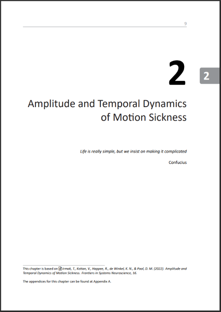
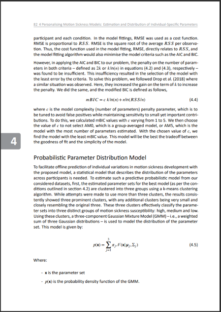

# TU Eindhoven PhD Thesis Template

This is an adapted version of the [TU Delft PhD thesis
template](https://github.com/varunkotian/TU-Delft-PhD-Dissertation-Template.git) by Varun Kotian for TU Eindhoven. It
features a large number of changes to increase both on- and off-screen
readability and quality, as well as reduce printing costs. It is a
double-sided, colored dissertation style with hyperlinks (although many of
these parameters can be easily changed).

I did not create the original template. However, I would appreciate it
if you did keep the note that you are using this adopted version of
the template.

## Style

Here is a side-by-side comparison of the two styles.

<table width="100%">
  <thead>
    <tr>
      <th width="33%">Old Style</th>
      <th width="33%">Inventitech</th>
      <th width="33%">New (this template)</th>
    </tr>
  </thead>
  <tbody>
    <tr>
      <td align="center"></td>
      <td align="center"></td>
      <td align="center"></td>
    </tr>
    <tr>
      <td align="center"></td>
      <td align="center"></td>
      <td align="center"></td>
    </tr>
  </tbody>
</table>

Note that there
are small differences between the online and print versions (such as
cutter's marks to trim pages and page alignment on the print
version). These are hard to get right, and I optimized them using two
physical proof prints of my thesis.

The layout in this repository is very well-readable, but rather close
to the low limits for font size and page utilization that I would use
(i.e., if anything, I would recommend to increase font size, line
height or page margins).

## Key Changes

Specifically, the changes in this template make these key improvements
over the TU Delft dissertation house style, Inventitech's and Varun's style: It ...

- has changed title page as per TU Eindhoven requirments

## Setup and Installation

See the original [README](README.txt).

There are three document options to the provided dissertation.cls style -- be sure to use `print` when sending to the printer.

